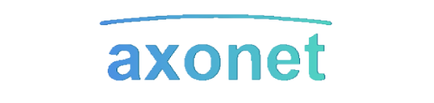

<h1 align="center">jaxron</h1>

  🌟 <b>Tech Enthusiast</b> | 🚀 <b>Software Engineer</b> | 🎨 <b>Code Architect</b>

  I enjoy building efficient, scalable software with a focus on performance and clean architecture. Specializing in Go and Zig for backend development, I tackle complex problems and build innovative tools. Beyond coding, I explore new technologies, contribute to open-source, and share knowledge with the developer community.

---

## 🔭 Active Projects

<table>
  <tr>
    <td align="center">
      
      
A custom HTTP client library for Go, offering middleware options for enhanced request handling. Features include circuit breaker, retry mechanism, rate limiting, and more.

      
      
    </td>
    <td align="center">
      
      
A modular and beginner-friendly API wrapper for Roblox, built in Go. Uses axonet's features to ensure seamless platform integration and ease of use.

      
      
    </td>
  </tr>
  <tr>
    <td align="center">
      
      
Revolutionizing key-value caching with Zig by offering flexible and efficient caching strategies. Leveraging <code>comptime</code> with zero-cost abstractions for better performance.

      
      
    </td>
    <td></td>
  </tr>
</table>
